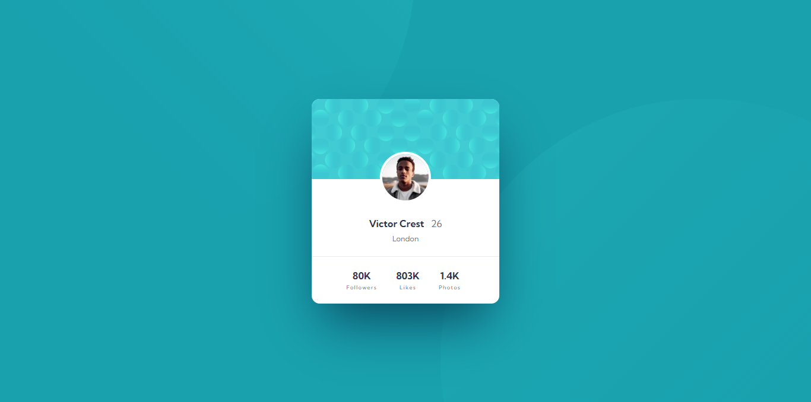
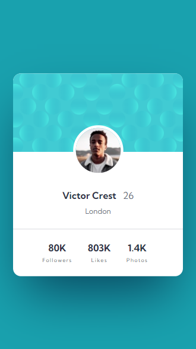

# Frontend Mentor - Profile Card Component

## Welcome! 👋

Thanks for checking out this front-end coding challenge.

This is a solution to the **Profile card component** challenge on [Frontend Mentor](https://www.frontendmentor.io). Frontend Mentor challenges help you improve your coding skills by building realistic projects.

## Table of Contents

- [Overview](#overview)
  - [The challenge](#the-challenge)
  - [Screenshot](#screenshot)
  - [Links](#links)
- [My process](#my-process)
  - [Built with](#built-with)
  - [What I learned](#what-i-learned)

## Overview

### The challenge

Your users should be able to:

- View the optimal layout depending on their device's screen size
- See hover states for interactive elements

### Screenshot

#### Desktop

#### Mobile

### Links

- Solution URL: [GitHub Repository](https://github.com/harisdev-netizen/profile-card-component)
- Live Site URL: [Live Preview](https://profile-summary.netlify.app/)

## My process

### Built with

- Semantic HTML5 markup
- CSS custom properties
- Flexbox

### What I learned

1. **Google Fonts Integration:**
   - I learned how to easily integrate web fonts by using the `@import` rule to include Google Fonts. For this project, I used the "Kumbh Sans" font, which added a modern and clean look to the typography.

2. **CSS Reset:**
   - By resetting margins, paddings, and setting `box-sizing: border-box`, I ensured that the layout remained consistent across different browsers. This avoids unexpected spacing issues.

3. **Flexbox Layout:**
   - I used Flexbox to center the content both horizontally and vertically. The `display: flex; justify-content: center; align-items: center;` properties simplified the layout management and ensured responsiveness without complex calculations.

4. **Positioning and Layering:**
   - I applied `position: absolute;` to elements like the background circles and profile image, gaining full control over their placement. This technique allowed me to create visually appealing layers while keeping the design clean and organized.

5. **Responsive Design with Media Queries:**
   - I learned how to use media queries to handle smaller screen sizes. By hiding large background elements and adjusting paddings, I ensured the design adapts well to mobile devices.

6. **Box Shadows for Depth:**
   - I experimented with box shadows (`box-shadow`) to give the profile card a floating effect. This subtle touch adds depth to the design and makes the card stand out from the background.

This project helped me solidify my understanding of **responsive design**, **Flexbox layouts**, and **CSS positioning** techniques, enhancing my ability to create polished, professional designs.
